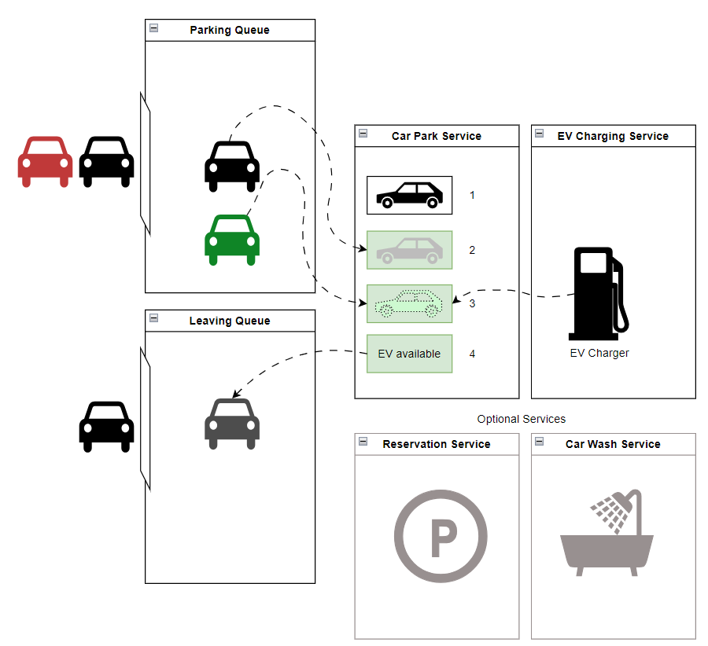

# Basic Parking Application
MVP:
- When the car comes in, check if there is a space and allocate space if available, otherwise give message saying full.   Let us assume the car park size is 100.
- When the car leaves, calculate the time spent and charge £2 per hour.  We don’t need the payment module but just returning the amount is enough.
- Handle multiple cars coming at the same time.

## Implementation

### Vehicle:
Vehicle supposed to have variations by:
- Engine Type: COMBUSTION | ELECTRICAL 
- Wheel Base : 2-Wheeler : 4-Wheeler.  

### Car Park Service: 
Handles requests to park and unpark a vehicle. Methods `park()` and `leave()` are synchronized for thread safety.
Car Park consists of storeys, that implements Synchronized thread-safe List. 
This is successfully tested in `CarParkApplicationTest` class by creating to concurrent threads that are trying to park `free` vehicles.

### Payment Service:
Calculates parking cost based on Duration of the Parking Session.

### Persistence:
Persistence implemented with Spring Data JPA ORM, and for simplicity support H2 in memory db.

### Assumptions:
It's assumed that there are physical gates that read plate numbers from vehicles and produce printed tickets for them.
Drivers supposed to park their vehicles according to the given place.
On exit, they should pay for the parking service.
Same vehicle can't be parked twice, so the system will reject to issue parking ticket for it.
If there is an error in reading plate number of departing vehicle, system will throw an error as well.
When issuing a parking ticket system doesn't deal with reserved parking space at the moment, instead it picks parking space randomly at any storey level.  

Currently, application doesn't deal with EV. However, there is room to handle that. 
Most simple way if dealing with EV/non-EV is:
- either not to let vehicles with combustion engine to take EV Enabled parking spaces
- or, let vehicles with combustion engine to park at EV Enabled spaces but apply surcharge.
Application assumes there are no issues with payment transactions but this is still can be handled in the Payment service.

### Further improvements:
Currently, system assumes that gates are not letting vehicles in unless another vehicle completely left the parking. 
System assumes that drive always parks to the given place on the ticket. For this purpose, our Synchronized List of parking spaces works fine.
To make close to real world we should introduce two Queues: 
- Parking Queue
- Leaving Queue
This will also need some messaging pattern to make Queue Service Observable. Once change in any of queues happened, a queue watcher should start in separate thread and either let another car park from Parking Queue, or update close Parking Session for a car that has just left the Leaving Queue.
Same as in real world human might stay unpredictable time in the Parking Queue and that should count into their parking charge. As well as they can try an cheat when leaving, so might want to reject the leaving gate if they were in Leaving Queue longer than some threshold time and make them pay extra.

Additional services could be added:
- Reservation Service (parking on demand)
- Car Washing Service - while car is being washed, it's in a parking queue. If driver decides to leave parking within 5 minutes after their has been washed, they won't be charged for parking.  

